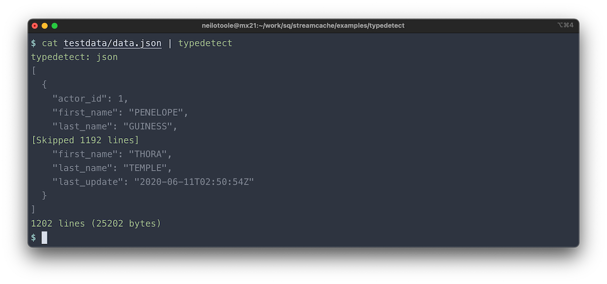
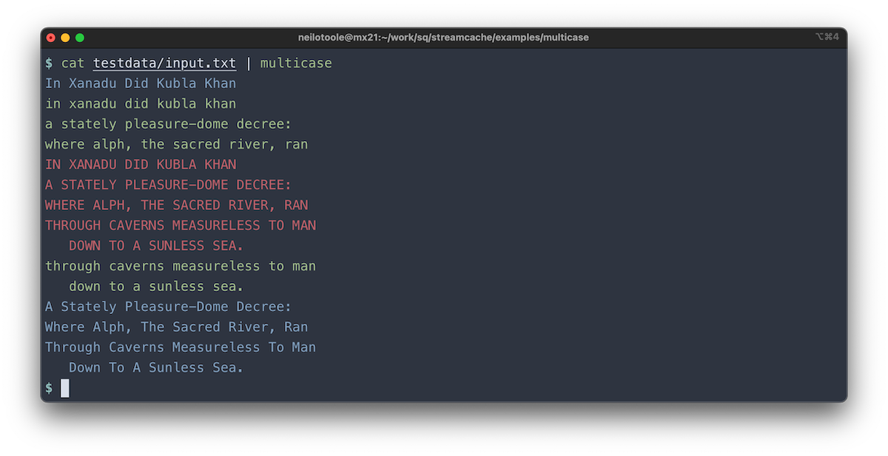

# streamcache: in-memory caching stream reader

[](https://pkg.go.dev/github.com/neilotoole/streamcache)
[](https://goreportcard.com/report/neilotoole/streamcache)
[](https://github.com/neilotoole/streamcache/blob/master/LICENSE)


Package [`streamcache`](https://pkg.go.dev/github.com/neilotoole/streamcache)
implements a Go in-memory byte cache mechanism that allows multiple callers to
read some or all of the contents of a source `io.Reader`, while only reading
from the source reader once. When only the final reader remains, the cache is
discarded and the final reader reads directly from the source. This is particularly
useful for scenarios where multiple readers may wish to sample the start of a
stream, but only one reader will read the entire stream.

Let's say we have a program [`typedetect`](./examples/typedetect),
and we're reading from ``stdin``. For example:

```shell
$ cat myfile.ext | typedetect  
```

In this scenario, `typedetect` wants to detect
and print the type of data in the file/pipe, and then print the contents.
That detection sampling could be done in a separate goroutine per sampler type.
The input file could be, let's say, a JSON file, or an XML file.

The obvious approach is to inspect the first few tokens of the
input, and check if the tokens are either valid JSON or valid XML.
After that process, let's say we want to dump out a preview of the file contents.

Package `streamcache` provides a facility to create a `Stream` from an
underlying `io.Reader` (`os.Stdin` in this scenario), and spawn multiple
readers, each of which can operate independently, in their own
goroutines if desired. The underlying source (again, `os.Stdin` in this
scenario) will only once be read from, but its data is available to
multiple readers, because that data is cached in memory.

That is, until there's only one final reader left, (after invoking
`Stream.Seal`), at which point the cache is discarded, and
the final `Reader` reads directly from the underlying source.

## Usage

Add to your `go.mod` via `go get`:

```shell
go get github.com/neilotoole/streamcache
```

Here's a simple [example](./examples/in-out-err) that copies the contents
of `stdin` to `stdout` and `stderr`, and prints the number of bytes read.

```go
package main

import (
    "context"
    "errors"
    "fmt"
    "io"
    "os"

    "github.com/neilotoole/streamcache"
)

// Write stdin to both stdout and stderr.
// Some error handling omitted for brevity.
func main() {
    ctx := context.Background()
    stream := streamcache.New(os.Stdin)

    r1 := stream.NewReader(ctx)
    go func() {
        defer r1.Close()
        io.Copy(os.Stdout, r1)
    }()

    r2 := stream.NewReader(ctx)
    go func() {
        defer r2.Close()
        io.Copy(os.Stderr, r2)
    }()
    
    stream.Seal()   // Indicate that there'll be no more readers...
    <-stream.Done() // Receives when all readers are closed.

    if err := stream.Err(); err != nil && !errors.Is(err, io.EOF) {
        fmt.Fprintln(os.Stderr, "error:", err)
        os.Exit(1)
    }

    fmt.Fprintf(os.Stdout, "Read %d bytes from stdin\n", stream.Size())
}
```

Executing the above program:

```shell
$ go install github.com/neilotoole/streamcache/examples/in-out-err
$ echo "hello world" | in-out-err
hello world
hello world
Read 12 bytes from stdin
```

## Examples

- [`in-out-err`](./examples/in-out-err): copy `stdin` to both `stdout` and `stderr`.
- [`typedetect`](./examples/typedetect): detect the type of input data, and print the head and tail
  of the contents.
  
- [`multicase`](./examples/multicase): transform each line of input to upper, lower, and title case.
  

## Related work

- [`djherbis/fscache`](https://github.com/djherbis/fscache)
