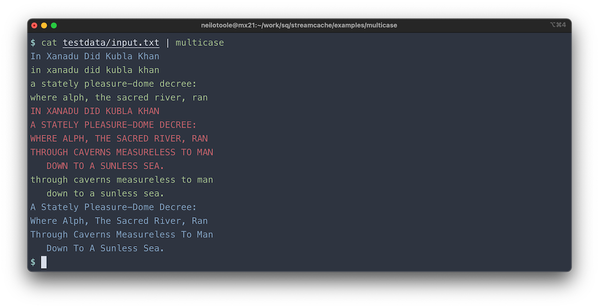

# multicase

`multicase` is a trivial program that reads input from `stdin` and echoes
it to `stdout` in lower, upper, and title case. It demonstrates
use of the [`neilotoole/streamcache`](https://github.com/neilotoole/streamcache)
Go package.

## Usage

```shell
$ go install github.com/neilotoole/streamcache/examples/multicase
$ echo "hello world" | multicase
```


